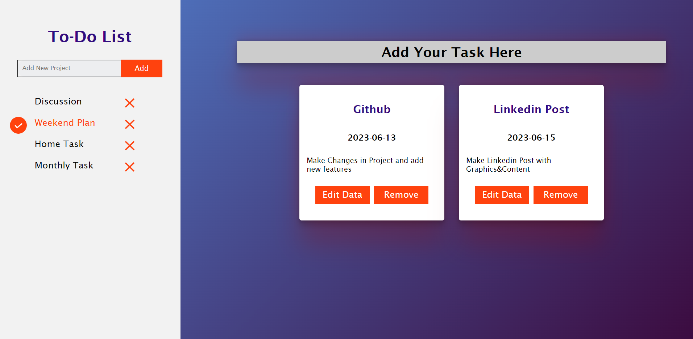

# ToDo-List

Task Creation: The ability to create and add new tasks to the list. This includes specifying a task title, description, due date, priority, and any other relevant details.
 
Task Organization: Options for categorizing or grouping tasks into different lists or categories, such as personal, work, shopping, or custom categories based on your needs.

<ul>
  <li>npm install webpacks</li>
   <li>npm init</li>
   <li>npm css-loader</li>
  <li>npm style-loader</li>
</ul>
